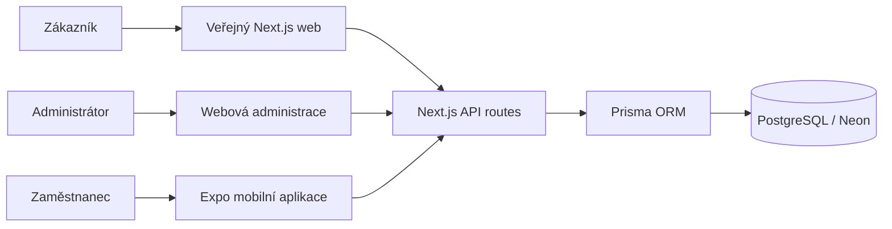

# Architektura projektu - Salon Zuza

> Aktualizováno: 12. 9. 2026
> Next.js 16 · React 19 · TypeScript · Prisma ORM · PostgreSQL (Neon) · pnpm · Expo SDK 57

## 1. Přehled systému

Salon Zuza je monorepo obsahující tři propojené vrstvy:

1. Veřejný web - prezentace salonu, služby, ceník, galerie, kontakt a online rezervace.
2. Webová administrace - správa rezervací a provozních dat salonu v `/admin`.
3. Mobilní administrace - React Native/Expo aplikace v `apps/mobile/` pro Android a iOS.

Všechny klientské části používají stejné Next.js API a stejnou PostgreSQL databázi. Databáze je zdrojem pravdy pro rezervace, služby, zaměstnance, provozní dobu i obsah webu.

Samostatný vizuální diagram s hlavními datovými toky je v [docs/architecture-diagram.md](./docs/architecture-diagram.md).



## 2. Kořenová struktura

```text
salonzuza/
├── app/                         # Next.js App Router: stránky, layouty a API
│   ├── api/                     # veřejné a administrativní endpointy
│   ├── admin/                   # vstup do nové webové administrace
│   ├── online-rezervace/        # zákaznický rezervační tok
│   ├── cenik/ sluzby/ galerie/  # veřejné obsahové stránky
│   ├── preview/                 # náhledy komponent z administrace
│   ├── layout.tsx
│   ├── page.tsx
│   └── instrumentation.ts
├── components/                  # sdílené UI a veřejné salon komponenty
│   ├── booking/
│   ├── salon/
│   └── ui/                      # shadcn/ui a Radix komponenty
├── features/                    # hlavní feature moduly nové administrace
│   ├── booking/                 # BookingWidget a typy rezervací
│   ├── analytics/
│   ├── cenik/
│   ├── content/
│   ├── employees/
│   └── media/
├── admin-kit/                   # admin shell, auth, routing a sdílené UI
│   ├── core/
│   ├── api/
│   ├── modules/
│   └── ui/
├── adminfunctions/              # legacy admin komponenty a kompatibilní API
├── hooks/                       # sdílené React hooky
├── lib/                         # databáze, auth, validace a doménová logika
├── models/                      # mapování Prisma dat na aplikační typy
├── prisma/schema.prisma         # PostgreSQL datový model
├── scripts/                     # interní seed, diagnostika a databázové utility (lokálně)
├── types/                       # sdílené TypeScript typy
├── apps/mobile/                 # samostatná Expo mobilní aplikace
├── public/                      # statická média a obrázky salonu
├── proxy.ts                     # Next.js 16 proxy: maintenance routing
├── next.config.mjs
├── tailwind.config.ts
└── package.json                 # kořenové skripty a závislosti
```

Generované adresáře jako `apps/mobile/android/`, `.expo/` nebo `.gradle_home/` nejsou zdrojovou architekturou a nemají se ručně upravovat. Nativní projekty se generují přes Expo prebuild v CI nebo lokálně.

## 3. Veřejný web

Hlavní veřejné stránky:

| Cesta | Účel |
|---|---|
| `/` | Úvodní stránka salonu |
| `/sluzby` | Přehled služeb |
| `/cenik` | Ceník služeb a kategorií |
| `/galerie` | Galerie prací |
| `/kontakt` | Kontaktní informace |
| `/online-rezervace` | Online vytvoření rezervace |
| `/online-rezervace/dekujeme` | Potvrzení odeslané rezervace |
| `/privacy`, `/terms` | Právní informace |

Sdílené komponenty v `components/salon/` vykreslují navigaci, hero sekci, recenze, galerii, mapu, CTA a patičku. Texty vybraných částí se načítají z CMS pomocí `hooks/use-obsah-stranky.ts` a komponenty `DatabaseText`.

Online rezervace používají service-first tok: zákazník vybírá službu, zaměstnance, datum a dostupný čas. Dostupnost se nepočítá pouze na klientovi, ale ověřuje se serverově podle databázových pravidel.

## 4. Nová webová administrace

Vstupní route `app/admin/[[...slug]]/` skládá:

```text
AdminCatchAllPage
└── AuthProvider + AdminProvider
    └── AdminRouterProvider
        └── ProtectedRoute
            └── AdminLayout
                └── AdminDashboardRouter
                    └── SalonDashboard
```

`admin-kit` poskytuje infrastrukturu administrace:

- `core/auth/` - přihlášení, session, JWT/proxy a ochrana route,
- `core/routing/` - mapování slugů na dashboard a moduly,
- `core/layout/` - jednotný layout a navigace,
- `ui/` - kalendář, tabulky, formuláře, error boundary a loading stav.

Konkrétní Salon Zuza funkce jsou v `features/` a jsou v `SalonDashboard` skládány podle oprávnění uživatele:

| Modul | Funkce |
|---|---|
| `features/booking/BookingWidget.tsx` | seznam rezervací, filtry, kalendář, detail, vytvoření/editace, hromadné akce a blokované termíny |
| `features/employees/EmployeeManager.tsx` | zaměstnanci, aktivita, rozvrhy, dovolené a viditelnost |
| `features/cenik/CenikManager.tsx` | kategorie, služby, ceny, délky a drag-and-drop pořadí |
| `features/content/PageContentEditor.tsx` | CMS texty, kategorie, pořadí a live preview |
| `features/media/MediaManager.tsx` | nahrávání, výběr a správa médií |
| `features/analytics/AnalyticsWidget.tsx` | přehled návštěvnosti a grafy |
| `admin-kit/modules/profile/` | profil a změna hesla |
| `features/support/` | hlášení problému |

Legacy komponenty v `adminfunctions/` zůstávají kvůli kompatibilitě; například `adminfunctions/admin/components/BookingWidget.tsx` je historická varianta rezervací. Nové změny administračního dashboardu se mají přednostně dělat ve `features/` a `admin-kit`.

## 5. Mobilní administrace

Mobilní aplikace je samostatný Expo projekt v `apps/mobile/`:

```text
apps/mobile/
├── App.tsx
├── src/api.ts                         # autorizované API volání
├── src/hooks/useMobileAdminApp.ts     # centrální stav a orchestrace
├── src/components/
│   ├── DashboardScreen.tsx
│   ├── ReservationsScreen.tsx
│   ├── CalendarScreen.tsx
│   ├── LocalDraftReservationForm.tsx
│   ├── ReservationDetailSheet.tsx
│   ├── SettingsScreen.tsx
│   └── ...
├── src/storage.ts                     # AsyncStorage/SecureStore adaptér
├── src/drafts.ts                      # offline drafty a synchronizace
├── src/theme.ts / ThemeContext.tsx    # System/Light/Dark motiv
├── assets/                            # ikona a splash obrazovka
├── app.json
└── metro.config.js
```

Mobilní aplikace podporuje:

- přihlášení stejnými údaji jako webová administrace,
- zapamatování přihlášení a volitelně přihlašovacích údajů,
- dashboard, kalendář a seznam rezervací,
- aktuální stav rezervací načítaný z API,
- detail rezervace, telefon, e-mail a změnu statusu,
- služby seskupené podle kategorií,
- datum a časy načítané z `/api/rezervace/dostupne-terminy`,
- lokální draft při výpadku sítě,
- automatickou synchronizaci po načtení dat a ruční synchronizaci v nastavení,
- světlý, tmavý a systémový motiv.

Offline draft není samostatný zdroj pravdy. Po úspěšném odeslání se odstraní z lokálního úložiště a serverová rezervace se přidá do lokálního seznamu.

### Distribuce mobilní aplikace

- `.github/workflows/build-apk.yml` sestavuje Android release APK.

- Expo Go slouží pouze pro vývoj/testování a nemusí zobrazovat nativní ikonu nebo splash konfiguraci.

## 6. Rezervační doména a dostupnost

Hlavní logika je rozdělena mezi:

- `app/api/rezervace/route.ts` - GET/POST rezervací,
- `app/api/rezervace/[id]/route.ts` - změna a mazání rezervace,
- `app/api/rezervace/dostupne-terminy/route.ts` - dostupné časy,
- `lib/reservations/availability.ts` - rozvrhy, dovolené, den volna a překryvy,
- `lib/reservations/stav.ts` - stavové konstanty a blokující statusy,
- `features/booking/BookingWidget.tsx` - webové ovládání,
- `apps/mobile/src/api.ts` - mobilní klient.

Výpočet dostupnosti zohledňuje:

1. provozní hodiny a den v týdnu,
2. aktivní službu a její délku,
3. konkrétního zaměstnance nebo dostupnost alespoň jednoho aktivního zaměstnance,
4. pracovní rozvrh a dovolenou,
5. blokované termíny a rezervace ve stavech, které blokují kapacitu,
6. délku celé služby při ověřování překryvu.

Server generuje časové sloty po 45 minutách. Klient zobrazuje pouze položky s `available: true`; prázdný výsledek se odlišuje od chyby sítě.

## 7. API vrstvy

### Veřejná a doménová API

| Endpoint | Metody | Účel |
|---|---|---|
| `/api/rezervace` | GET, POST | načtení a vytvoření rezervace |
| `/api/rezervace/[id]` | PUT, DELETE | změna statusu a mazání |
| `/api/rezervace/dostupne-terminy` | GET | výpočet volných termínů |
| `/api/cenik` | GET, POST | veřejný ceník |
| `/api/galerie` | GET, POST | galerie |
| `/api/cms/page-content` | GET, POST, PUT | veřejné čtení a CMS obsah |
| `/api/email/*` | POST | e-mailová komunikace |
| `/api/notifications/*` | POST | e-mail, SMS a denní připomínky |

### Administrativní API

| Oblast | Endpointy |
|---|---|
| Auth | `/api/admin/auth/*`, legacy `/api/auth/*` |
| Rezervace | `/api/admin/rezervace/blokovane-terminy/*`, `/api/admin/recent-activity` |
| Ceník | `/api/admin/cenik/*`, `/api/admin/sluzby` |
| Zaměstnanci | `/api/admin/zamestnanci/*`, `/api/admin/provozni-hodiny` |
| CMS | `/api/admin/page-content`, `/api/admin/page-content/poradi` |
| Média | `/api/admin/media/list`, `upload`, `delete` |
| Profil a podpora | `/api/admin/profile/*`, `/api/admin/report-issue` |
| Analytika | `/api/admin/analytics`, `/api/admin/google-analytics` |


Autentizované klientské požadavky používají session/token mechanismus webové administrace. Mobilní aplikace posílá přístupový token v autorizační hlavičce; žádné skutečné tokeny ani přihlašovací údaje nejsou součástí repozitáře.

## 8. Datová vrstva

`prisma/schema.prisma` definuje PostgreSQL modely:

| Model | Účel |
|---|---|
| `ObsahStranky` | CMS texty, klíče, kategorie, aktivita a pořadí |
| `KategorieSluzeb` | kategorie ceníku |
| `Sluzba` | služba, délka, ceny, kategorie a pořadí |
| `GalerieObrazek`, `Fotka` | veřejná a administrační média |
| `Recenze` | zákaznické recenze a schválení |
| `Zamestnanec` | zaměstnanec, kontakt, rozvrh, dovolená a oprávnění |
| `EmployeeVisibility` | omezení viditelnosti mezi zaměstnanci |
| `Rezervace` | zákazník, datum, čas, služba, zaměstnanec, cena a status |
| `ProvozniHodiny` | otevírací doba podle dne v týdnu |
| `BlokovanyTermin` | ruční blokace termínů |
| `ZpravaKontaktu` | zprávy z kontaktního formuláře |
| `IssueReport` | hlášení problémů z administrace |

Přístup k databázi centralizuje `lib/db.ts` a pomocné repository/util vrstvy v `lib/db/`. Mapování databázových výsledků pro vybrané oblasti je v `models/`.

## 9. Autentizace a oprávnění

Webová administrace používá `AuthProvider`, `AdminProvider`, `ProtectedRoute` a role guardy z `admin-kit/core/auth/`. Přihlášení probíhá přes vlastní admin auth endpointy a session/token je používán při dalších API požadavcích.

Mobilní klient ukládá session v bezpečném úložišti a přihlašovací údaje ukládá pouze při aktivní volbě „Zapamatovat přihlašovací údaje“. Přístup k administrativním API je autorizován bearer tokenem.

Oprávnění ovlivňují dostupnost modulů administrace, zejména správy obsahu, ceníku a dalších citlivých částí. Kontrola oprávnění musí probíhat také na serverovém endpointu, ne pouze skrytím prvku v UI.

## 10. Proxy, maintenance a observabilita

`proxy.ts` je Next.js 16 proxy. Pokud je `MAINTENANCE_MODE=true`, přesměruje běžné veřejné stránky na `/maintenance`, ale ponechá dostupné maintenance stránku, online rezervace, `/admin`, API a Next.js assety.

Observabilita a externí služby:

- Google Analytics přes `@google-analytics/data` a administrační analytics API,
- Vercel Analytics a Speed Insights,
- Resend pro e-mailové zprávy,
- volitelné SMS notifikace,
- konzolové logy API route pro diagnostiku.

## 11. CI/CD a vývoj

Kořenové příkazy:

```powershell
pnpm dev
pnpm build
pnpm run db:test
pnpm prisma generate
pnpm prisma db push
pnpm run salon:init
pnpm mobile:start
pnpm mobile:typecheck
```

Databázové a seed skripty jsou interní a zůstávají pouze v lokálním pracovním prostředí. Změna `prisma/schema.prisma` vyžaduje regeneraci Prisma klienta.

CI:

- `build-apk.yml` - Expo prebuild Android a release APK artifact,


## 12. Architektonické zásady

| Oblast | Zásada |
|---|---|
| Source of truth | PostgreSQL přes Prisma; mobilní úložiště je pouze cache/offline fronta |
| Frontend | Server Components pro data-fetching, client komponenty jen pro interakci |
| Typy | TypeScript strict; nové API a komponenty mají používat konkrétní typy |
| Validace | Preferovat Zod na hranicích API |
| UI | Existující shadcn/ui, Radix a projektové komponenty před novými paralelními řešeními |
| Styling | Tailwind CSS na webu, theme-aware `StyleSheet` na mobilu |
| API | Autorizované požadavky přes existující auth utility a bearer session |
| Data změny | Rezervace a dostupnost se ověřují serverově; klientská validace není jediná ochrana |
| Mobilní offline | Neodeslané drafty se zachovají a opakují při dalším načtení/synchronizaci |
| Nativní buildy | Android/iOS projekty generuje Expo; buildy probíhají přes GitHub Actions |

## 13. Známé hranice a technický dluh

- `adminfunctions/` obsahuje legacy implementace; při rozšiřování je nutné ověřit, zda konkrétní route používá novou nebo starou variantu.
- Mobilní synchronizace reaguje na načtení dat a ruční akci; samostatný listener pro okamžité obnovení síťového připojení zatím není zaveden.

 
