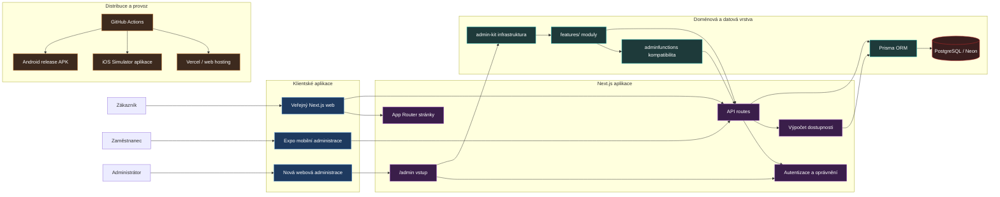
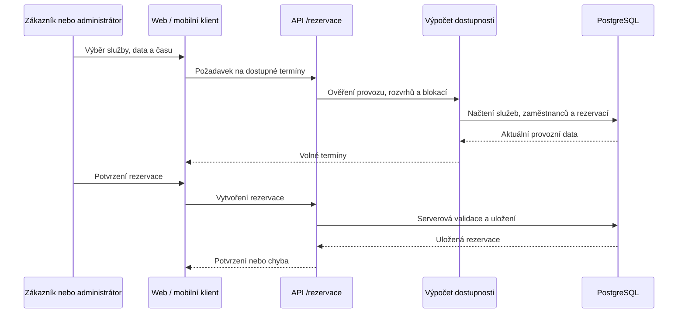

# Architektura Salon Zuza

Diagram je v Mermaid formátu, který GitHub automaticky vykreslí jako vizuální diagram.

```mermaid
flowchart LR
    CUSTOMER["Zákazník"]
    ADMIN["Administrátor"]
    STAFF["Zaměstnanec"]

    subgraph CLIENTS["Klientské aplikace"]
        WEB["Veřejný Next.js web"]
        ADMIN_WEB["Nová webová administrace"]
        MOBILE["Expo mobilní administrace"]
    end

    subgraph NEXT["Next.js aplikace"]
        PAGES["App Router stránky"]
        ADMIN_ENTRY["/admin vstup"]
        API["API routes"]
        AVAILABILITY["Výpočet dostupnosti"]
        AUTH["Autentizace a oprávnění"]
    end

    subgraph DOMAIN["Doménová a datová vrstva"]
        FEATURES["features/ moduly"]
        ADMIN_KIT["admin-kit infrastruktura"]
        LEGACY["adminfunctions kompatibilita"]
        PRISMA["Prisma ORM"]
        DATABASE[("PostgreSQL / Neon")]
    end

    subgraph DELIVERY["Distribuce a provoz"]
        ACTIONS["GitHub Actions"]
        APK["Android release APK"]
        IOS["iOS Simulator aplikace"]
        VERCEL["Vercel / web hosting"]
    end

    CUSTOMER --> WEB
    ADMIN --> ADMIN_WEB
    STAFF --> MOBILE

    WEB --> PAGES
    ADMIN_WEB --> ADMIN_ENTRY
    MOBILE --> API
    WEB --> API
    ADMIN_ENTRY --> AUTH
    ADMIN_ENTRY --> ADMIN_KIT
    ADMIN_KIT --> FEATURES
    FEATURES --> LEGACY
    FEATURES --> API
    LEGACY --> API
    API --> AUTH
    API --> AVAILABILITY
    API --> PRISMA
    AVAILABILITY --> PRISMA
    PRISMA --> DATABASE

    ACTIONS --> APK
    ACTIONS --> IOS
    ACTIONS --> VERCEL

    classDef client fill:#1e3a5f,stroke:#4a90d9,color:#fff
    classDef next fill:#3a1e4a,stroke:#9a4ac9,color:#fff
    classDef domain fill:#1e3a3a,stroke:#2ac9c9,color:#fff
    classDef delivery fill:#3d2a1e,stroke:#c9742a,color:#fff
    classDef database fill:#3a1e1e,stroke:#c92a2a,color:#fff

    class WEB,ADMIN_WEB,MOBILE client
    class PAGES,ADMIN_ENTRY,API,AVAILABILITY,AUTH next
    class FEATURES,ADMIN_KIT,LEGACY,PRISMA domain
    class ACTIONS,APK,IOS,VERCEL delivery
    class DATABASE database
```

## Hlavní datový tok rezervace

```mermaid
sequenceDiagram
    participant U as Zákazník nebo administrátor
    participant C as Web / mobilní klient
    participant A as API /rezervace
    participant V as Výpočet dostupnosti
    participant DB as PostgreSQL

    U->>C: Výběr služby, data a času
    C->>A: Požadavek na dostupné termíny
    A->>V: Ověření provozu, rozvrhů a blokací
    V->>DB: Načtení služeb, zaměstnanců a rezervací
    DB-->>V: Aktuální provozní data
    V-->>C: Volné termíny
    U->>C: Potvrzení rezervace
    C->>A: Vytvoření rezervace
    A->>DB: Serverová validace a uložení
    DB-->>A: Uložená rezervace
    A-->>C: Potvrzení nebo chyba
```

